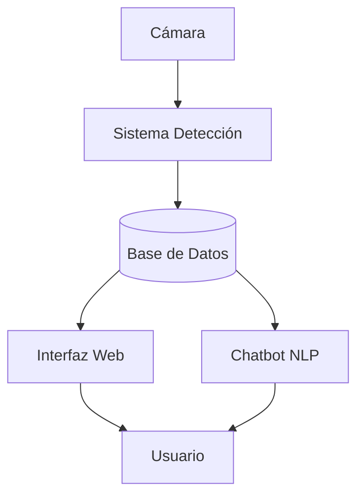

## Índice

1. [Arquitectura del Sistema](#arquitectura-del-sistema)
2. [Módulos del Sistema](#módulos-del-sistema)
3. [Base de Datos](#base-de-datos)
4. [Configuración](#configuración)
5. [Despliegue](#despliegue)
6. [Solución de Problemas](#solución-de-problemas)

## Arquitectura del Sistema



### Componentes Principales

1. **Capa de Detección**: Procesamiento de video con YOLO
2. **Capa de Datos**: Almacenamiento SQLite
3. **Capa de Interfaz**: Dashboard Streamlit
4. **Capa de Consultas**: Procesamiento NLP

## Módulos del Sistema

### 1. Sistema de Detección (`insightdom_model.py`)

Clasificación automática de aguacates por tamaño usando YOLO v8.

**Parámetros principales**:
```python
AREA_SMALL_MAX = 5000    # < 5000 px² → Pequeño
AREA_MEDIUM_MAX = 15000  # 5000-15000 px² → Mediano
```

**Uso**:
```bash
python insightdom_model.py --model modelos/avocado.pt --source 0
```

### 2. Interfaz Web (`interfaz.py`)

Dashboard con cuatro secciones:
- Dashboard: Métricas principales
- Datos: Registros históricos
- Gráficas: Visualizaciones
- Detector: Control del sistema

### 3. Procesamiento NLP (`nlp.py`)

Interpreta consultas en lenguaje natural sobre producción.

**Intenciones reconocidas**:
- Conteo de elementos
- Tamaño más frecuente
- Tendencia por hora
- Distribución por calidad

### 4. Gestión de Datos (`conexion.py`, `consultas.py`)

Conexión a SQLite y consultas predefinidas.

**Funciones principales**:
```python
from consultas import estadisticas_diarias, tamaño_mas_frecuente
```

## Base de Datos

### Esquema Principal

```sql
-- Tabla de detecciones
CREATE TABLE IF NOT EXISTS  aguacates(
    id INTEGER PRIMARY KEY , 
    calidad TEXT,
    tamaño TEXT, 
    fecha TEXT,
    categoria TEXT);
```

### Consultas Comunes

```python
# Estadísticas del día
from consultas import estadisticas_diarias
stats = estadisticas_diarias()

# Tamaño más frecuente
from consultas import tamaño_mas_frecuente
tam_frec = tamaño_mas_frecuente()
```

## Configuración

### Variables de Entorno (opcional)

```bash
QUALITYSENSE_DB_PATH=avocado_detections.db
QUALITYSENSE_MODEL_PATH=modelos/avocado.pt
QUALITYSENSE_CAMERA_SOURCE=0
```

### Optimización SQLite

```sql
PRAGMA journal_mode = WAL;
PRAGMA synchronous = NORMAL;
```

---


**Equipo**: Grupo 3 - Samsung Innovation Campus RD16  
**Año**: 10-12-25
**Versión**: 1.0.0